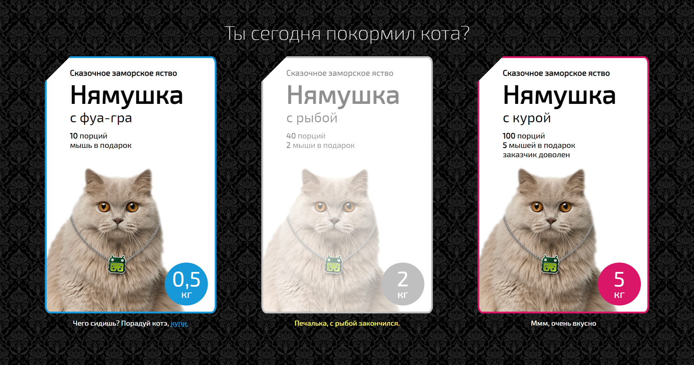
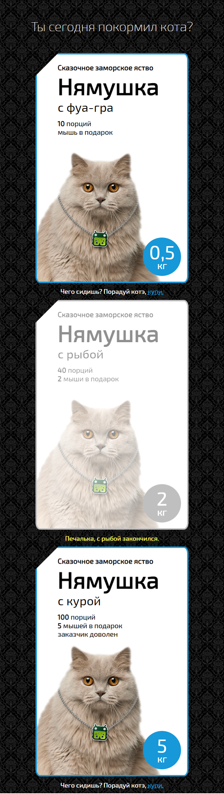

# CatFoodApp

Small responsive App made for https://funbox.ru/  
The title says "Did you feed the cat today?" 

Here is the stack:
* :hugs: HTML
* :yum: CSS
* :stuck_out_tongue_closed_eyes: JavaScript
* :thinking: ReactJS

Here is the Desktop view: 
 

Here is the Mobile view: 
 
